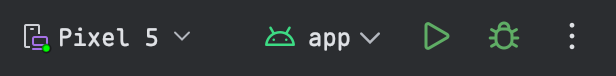
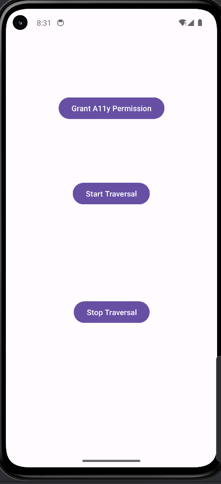
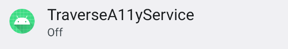
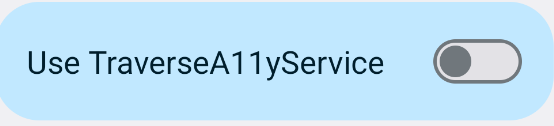

# SOMBRA

This is the codebase of SOMBRA for 2025 CCS AE. Its main functionality is matching app-side accessibility(a11y)-protected views with their mobile browser-rendered counterparts that are unprotected and visible to a11y services.
SOMBRA consists of an app-side a11y-protected view scanning module and an element matching module that finds the browser-rendered a11y-unprotectd elements that corresponds to those app-side views.

## App-side A11y-Protected View Scanning
This module discovers app-side a11y-protected views for an app both statically and dynamically.

### Static Scanning

#### Software Requirements
1. Python 3. This is tested with version 3.10.13, but any recent versions should also work.

#### Usage
Next, we show an example of running a static a11y-protected view scanning.

1. `cd` to the SOMBRA base directory.
2. `mkdir result`
3. Scan a11y protected views. Run `python3 scanA11yProtectedViews.py test/com.cvs.launchers.cvs result/a11yProtectedViews_com.cvs.launchers.cvs.json`. The `com.cvs.launchers.cvs` directory contains the [JADX](https://github.com/skylot/jadx) decompiled code of the app `com.cvs.launchers.cvs.apk`.
4. Scan a11y sensitive views. Run `python3 scanSensitiveViews.py test/com.cvs.launchers.cvs result/a11ySensitiveViews_com.cvs.launchers.cvs.json`.

#### Interpretation of Result
The `result/a11yProtectedViews_com.cvs.launchers.cvs.json` contains the file path, line number and the type of statically-defined app-side a11y protected views, such as ones being protected by `setAccessibilityDataSensitive`.
The `result/a11ySensitiveViews_com.cvs.launchers.cvs.json` contains the file path, line number and the type of statically-defined app-side sensitive views, which in this case are views protected with `filterTouchesWhenObscured` flag.

### (Optional) Dynamic Scanning
The `TraverseA11yService` app utilizing the a11y service could further help extract a11y-protected views that are dynamically defined.

#### Hardware Requirement
1. MacOS/Linux. Tested on MacOS 15.5. Should also work on any recent version of Linux.

#### Software Requirement
1. Download and install [Android Studio](https://developer.android.com/studio?gad_campaignid=21831783525&gbraid=0AAAAAC-IOZkrbRNAmCAvWmjcp5fLeh09A) (Tested on Meerkat 2024.3.2). Choose the correct version of app to install (Apple Silicon / Intel). 

#### Usage
1. `cd` to the SOMBRA base directory.
2. `mkdir result`
3. `cp ./test/Pixel_5.zip ~/.android/avd`
4. `unzip ~/.android/avd/Pixel_5.zip`. This imports an pre-built and pre-configured snapshot of an Android emulator image of an Pixel 5 phone running Android 14. The snapshot contains a pre-installed authenticator app which contains dynamically defined a11y protected views.
5. Open Android Studio.
6. On the main menu of Android Studio, click File->Open, then choose the `TraverseA11yService` folder located at `<SOMBRA dir>/TraverseA11yService`, then click Open.
7. Wait a few seconds to let gradle sync.
8. You should see an app testing bar on top of the UI like this:  Note: If you have other emulator images installed or physical phones connected, select 'Pixel 5' from the device drop down menu inside the app testing bar.
9. Then run the app on the Pixel 5 image by pressing the green play botton or ctrl+R on MacOS.
10. The device manager should boot up the image from the snapshot state and start the TraverseA11yService app. After a few seconds, your emulator screen should look like this: 
11. To run the app, first click the top botton labeled "Grant A11y Permission", then you will be redirected to the a11y settings screen, click the "TraverseA11yService" that looks like this: 
12. Then toggle on for the "Traverse a11y service": .
13. Then click allow. You will be redirected back to the app's main screen.
14. Click the second button "Start Traversal" to start dynamic scanning of the authenticator app. After a second, you will be redirected to the authenticator app's screen with a "test" field already pre-configured.
15. The service will automatically scan the current screen and log the dynamically protected passcode field as a11y-protected.
16. Then go back to our TraverseA11yService app by clicking the emulated "Back" left triagle button on top of the emulator control bar or by pressing command+shift+B on macOS.
17. Finally click the bottom "Stop Traversal" button to log the result to disk.
18. With the emulator still running, from the SOMBRA directory pull the result to local by running `~/Library/Android/sdk/platform-tools/adb pull /sdcard/Android/data/com.example.traversea11yservice/files/dumps/protected_views.csv ./result`. The `adb` binary should already be installed with Android Studio. If not, please [download adb](https://developer.android.com/tools/adb) before running the above command to pull the report to local.
19. Now exit Android Studio.

#### Interpretation of Result
The `result/protected_views.csv` contains the "otp-code" textview that is dynamically protected from accessibility services and exposes nothing in a11y text.

## Matching Unprotected Browser-Side Elements
This module matches the a11y-exposed browser-rendered elements for the app-side protected views.

#### Software Requirements
1. Python 3. This is tested with version 3.10.13, but any recent versions should also work.

#### Usage
Next, we show an example of matching browser-side elements.
1. `cd` to the SOMBRA base directory.
2. `pip install -r requirements.txt`
3. `mkdir result`
4. Run `python3 matchA11yElements.py test/com.cvs.launchers.cvs_app_traverse.csv test/cvs.com/ result/browserSideUnprotectedElements_cvs.com.csv`. The `test/com.cvs.launchers.cvs_app_traverse.csv` contains 2 `EditText` input boxes on the app-side that are a11y-protected as well as the `Button` clicking sequence from the main page to reach them. The `test/cvs.com/` contains the html for the mobile Chrome-rendered website including the account, payment, and finally the add card page.

#### Interpretation of Result
The `result/browserSideUnprotectedElements_cvs.com.csv` contains the matched browser-side elements to the `security code` field that is a11y-protected on the app-side. It also shows that there is no `aria-hidden` label defined for this element and that it is unprotected.